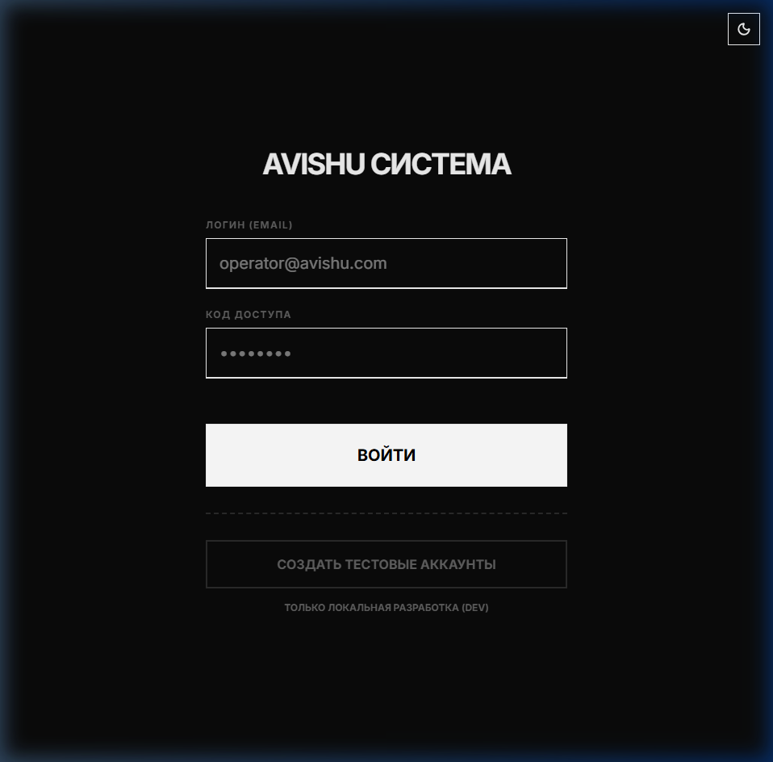
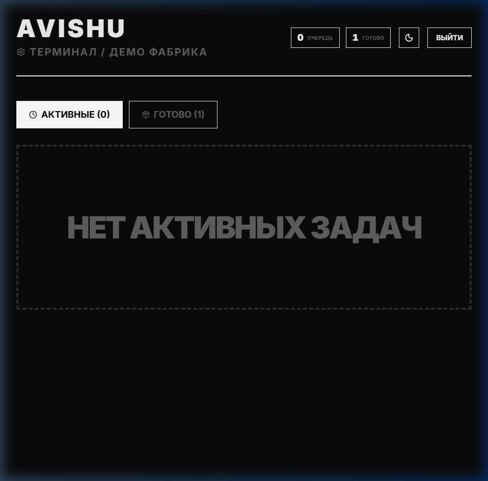
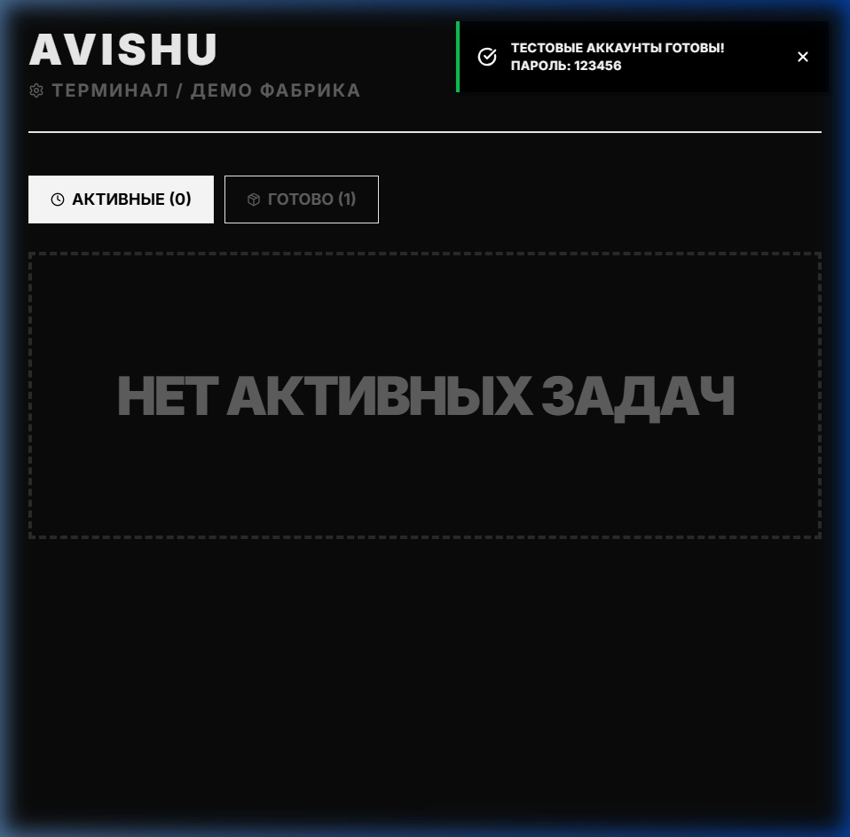
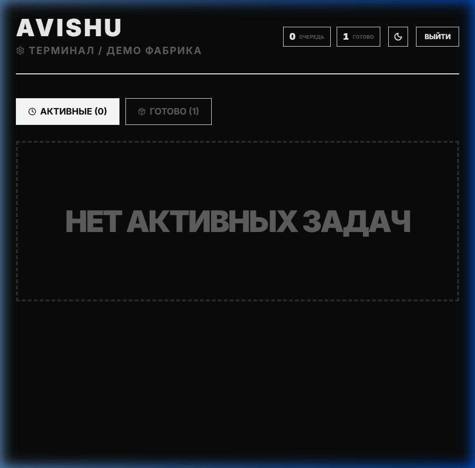

# AVISHU SuperApp

Одностраничное веб-приложение для модели **клиент → франчайзи → производство** в fashion-контуре: каталог и оформление заказов, канбан и метрики для франчайзи, очередь задач для цеха. Интерфейс на русском, бруталистская визуальная логика, светлая и тёмная тема.

---

## Содержание

1. [Возможности по ролям](#возможности-по-ролям)  
2. [Стек](#стек)  
3. [Требования](#требования)  
4. [Установка и запуск](#установка-и-запуск)  
5. [Переменные окружения](#переменные-окружения)  
6. [Firebase](#firebase)  
7. [Демо-аккаунты (только разработка)](#демо-аккаунты-только-разработка)  
8. [Скрипты npm](#скрипты-npm)  
9. [Маршруты](#маршруты)  
10. [Структура проекта](#структура-проекта)  
11. [Репозиторий](#репозиторий)

---

## Возможности по ролям

| Роль | Путь | Что делает |
|------|------|------------|
| **Клиент** | `/client` | Каталог товаров (в наличии / предзаказ), корзина, оформление заказа в Firestore, вкладка заказов с трекингом статусов (ОФОРМЛЕН → НА ПОШИВЕ → ГОТОВО), профиль с условной программой лояльности. |
| **Франчайзи** | `/franchisee` | Дашборд с метриками выручки и фильтрами, канбан по тем же статусам, смена статуса заказа по допустимым переходам. |
| **Производство** | `/production` | Очередь заказов в работе и список завершённых; продвижение статуса по этапам пошива. |

Общее: вход по email/паролю (Firebase Auth), данные профиля и роли в коллекции `users`, заказы в `orders`.

---

## Стек

- **React** 19, **Vite** 8  
- **React Router** 7  
- **Firebase** 12: Authentication (Email/Password), Cloud Firestore  
- **Zustand** — состояние (пользователь, тема, корзина)  
- **Tailwind CSS** 4 (через `@tailwindcss/vite`)  
- **lucide-react** — иконки  
- **ESLint** 9 (React Hooks, React Refresh)

---

## Требования

- **Node.js** 18+ (рекомендуется LTS)  
- **npm** (или совместимый менеджер пакетов)  
- Проект **Firebase** с включёнными **Authentication → Email/Password** и базой **Firestore**

---

## Установка и запуск

```bash
git clone https://github.com/ericoryn/avishu_superapp.git
cd avishu_superapp
npm install
```

Создайте файл `.env` в корне (см. следующий раздел) и выполните:

```bash
npm run dev
```

Приложение откроется по адресу, который покажет Vite (обычно `http://localhost:5173`).

---

## Переменные окружения

Все переменные для клиента имеют префикс **`VITE_`** — они попадают в сборку.

1. Скопируйте шаблон:

   ```bash
   copy .env.example .env
   ```
   (в Linux/macOS: `cp .env.example .env`)

2. Заполните значения из **Firebase Console → Project settings → Your apps → SDK setup and configuration** (конфиг веб-приложения).

| Переменная | Назначение |
|------------|------------|
| `VITE_FIREBASE_API_KEY` | API Key |
| `VITE_FIREBASE_AUTH_DOMAIN` | Auth domain |
| `VITE_FIREBASE_PROJECT_ID` | Project ID |
| `VITE_FIREBASE_STORAGE_BUCKET` | Storage bucket (если не используете Storage, всё равно укажите из конфига) |
| `VITE_FIREBASE_MESSAGING_SENDER_ID` | Sender ID |
| `VITE_FIREBASE_APP_ID` | App ID |

Соответствие полей в коде: `src/firebase.js`.

Файл **`.env`** не коммитится (см. `.gitignore`). В репозитории есть только **`.env.example`** без секретов.

---

## Firebase

### Проект

В `firebase.json` указаны правила Firestore: `firebase/firestore.rules`.  
Имя проекта по умолчанию в `.firebaserc`: `avishu-superapp` — при своём проекте замените на свой или выполните `firebase use --add`.

### Данные

- Коллекция **`users`**, документы с ID = `uid` из Auth. Поля: как минимум `name`, `role` (`client` | `franchisee` | `production`). Допускается синоним роли `factory` в Firestore — в приложении он приводится к `production`. URL `/franchise` редиректит на `/franchisee`.
- Коллекция **`orders`**: поля вроде `clientId`, `clientName`, `items`, `totalPrice`, `status` (строки на русском из набора этапов), `type` (`IN_STOCK` / `PREORDER`), `createdAt`, при предзаказе может быть `preorderDate`.

### Деплой правил Firestore

При установленном [Firebase CLI](https://firebase.google.com/docs/cli):

```bash
firebase login
firebase deploy --only firestore:rules
```

---

## Демо-аккаунты (только разработка)

На экране входа в режиме **`npm run dev`** (`import.meta.env.DEV === true`) доступна кнопка создания тестовых пользователей (регистрация в Auth + документы в `users`). Пароль для всех трёх: **`123456`**.

| Email | Роль в `users` |
|--------|----------------|
| `client@avishu.com` | client |
| `franchisee@avishu.com` | franchisee |
| `factory@avishu.com` | production |

В production-сборке кнопка сидов не показывается; пользователей нужно создавать через Firebase Console или Admin SDK.

---

## Скрипты npm

| Команда | Действие |
|---------|----------|
| `npm run dev` | Режим разработки (Vite HMR) |
| `npm run build` | Production-сборка в `dist/` |
| `npm run preview` | Локальный просмотр собранного `dist/` |
| `npm run lint` | Проверка ESLint по проекту |

---

## Маршруты

| URL | Назначение |
|-----|------------|
| `/` | Редирект на `/client`, `/franchisee` или `/production` в зависимости от роли; без входа — страница логина |
| `/franchise` | Редирект на `/franchisee` |
| `/client`, `/franchisee`, `/production` | Защищённые зоны по роли (`ProtectedRoute`) |
| `*` | Редирект на `/` |

---

## Структура проекта

```
avishu_superapp/
├── firebase/
│   └── firestore.rules    # правила безопасности Firestore
├── public/                # статика (favicon и т.д.)
├── src/
│   ├── components/        # ErrorBoundary, ProtectedRoute, Skeleton, ThemeToggle, toast/
│   ├── pages/
│   │   ├── Login.jsx
│   │   ├── client/Home.jsx
│   │   ├── franchisee/Dashboard.jsx
│   │   ├── franchisee/DashboardCards.jsx
│   │   └── production/Queue.jsx
│   ├── stores/            # useAuthStore, useCartStore, useThemeStore
│   ├── App.jsx
│   ├── main.jsx
│   ├── firebase.js        # инициализация Firebase
│   ├── constants.js       # этапы заказа, роли, переходы статусов
│   └── index.css          # темы и утилиты Tailwind
├── .env.example
├── firebase.json
├── index.html
├── package.json
└── vite.config.js
```

---

## Скриншоты экранов

| Логин / Выбор роли | Дашборд Франчайзи |
|:---:|:---:|
|  |  |

| Каталог Клиента | Терминал Производства |
|:---:|:---:|
|  |  |

---

## Репозиторий

Исходный код: **https://github.com/ericoryn/avishu_superapp**

---

## Лицензия

Проект не сопровождается отдельным файлом лицензии; при публичном использовании уточните условия у владельцев репозитория.
